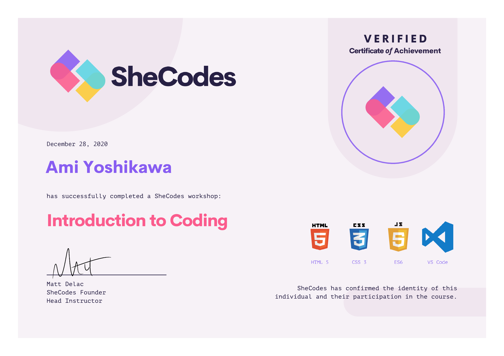

  

During December 2020, I signed up for a three-week online SheCodes workshop. Week 1 covered HTML/CSS basics. We then moved onto JavaScript basics in Week 2. For the final week, we took everything we learned to create an interactive, user-friendly website. Completion of this workshop helped me to reach the decision of going back to school to study Computer Science.

What I really appreciated about this workshop was that it allowed for us to connect with our fellow classmates via Slack, and we all helped each other touch up our assignments. It was also nice that the staff was always available to assist us in chat, regardless of the time difference for everyone involved. The curriculum was manageable, and I really liked that everyone (including the students) were so helpful and willing to collaborate. Altogether, it was a short and sweet course that introduced me to a new career path. 
